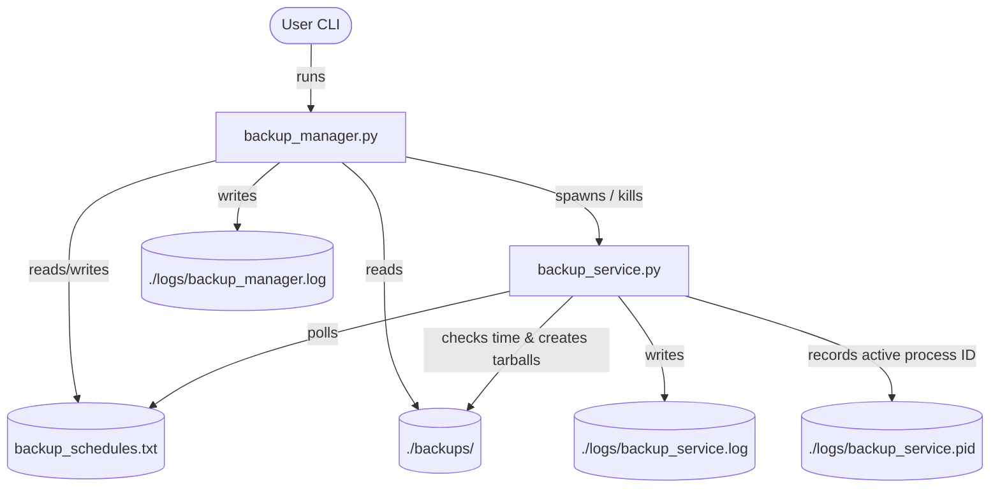

# Development Plan: Backup Manager

This document provides a detailed plan, architecture specification, and role assignment for implementing the Backup Manager project. The project is a modular backup orchestration utility comprised of a command-line controller (`backup_manager.py`) and a background scheduling daemon (`backup_service.py`).

---

## 1. Project Overview & Architecture

The Backup Manager is designed to manage and execute daily folder/file backups in a Unix environment using Python. It consists of two components:
1. **Command Line Interface (CLI)**: `backup_manager.py` allows users to create schedules, delete schedules, list schedules, list generated backups, and start/stop the background daemon.
2. **Background Daemon Service**: `backup_service.py` runs continuously in the background, monitors schedules in `backup_schedules.txt`, and generates compressed tarballs (`.tar`) in the `./backups` folder when schedules trigger.

### High-Level Components



---

## 2. Technical Specifications & Shared Interfaces

### A. The Schedules File (`backup_schedules.txt`)
- **Format**: Flat text file where each line is a semicolon-separated string:
  `path_to_save;time(hh:mm);backup_name`
  - Example: `testing;18:21;backup_test`
- **Integrity Guidelines**:
  - The CLI script (`backup_manager.py`) writes and deletes lines in this file.
  - The Daemon script (`backup_service.py`) reads this file read-only on each cycle.
  - Empty or malformed lines should be ignored by the daemon and logged as errors by both components.

### B. Process Orchestration & Daemon Tracking (`backup_service.pid`)
- To ensure only a single instance of `backup_service.py` runs and that the CLI can reliably stop it, we use a process ID (PID) file: `./logs/backup_service.pid`.
- **Start Process Flow (`backup_manager.py start`)**:
  1. Check if `./logs/backup_service.pid` exists.
  2. If it exists, read the PID and check if a process with that PID is active and running `backup_service.py`. If active, log `Error: backup_service already running` and abort.
  3. If not running, spawn `backup_service.py` in a new session using `subprocess.Popen` with the flag `start_new_session=True` (or equivalent Unix process isolation).
  4. Write the new PID to `./logs/backup_service.pid`.
  5. Log `[dd/mm/yyyy hh:mm] backup_service started`.
- **Stop Process Flow (`backup_manager.py stop`)**:
  1. Check if `./logs/backup_service.pid` exists.
  2. If it does not exist or the process is not active, log `Error: can't stop backup_service` (or `backup_service not running`) and abort.
  3. Read the PID, send a termination signal (`signal.SIGTERM` / `os.kill(pid, 15)`), wait briefly, and check if it has stopped.
  4. Clean up (delete) `./logs/backup_service.pid`.
  5. Log `[dd/mm/yyyy hh:mm] backup_service stopped`.

### C. Preventing Duplicate Backup Execution
Because the daemon runs in a loop checking the schedule, and sleeps for **45 seconds** (which is less than a minute), a schedule matching the current hour and minute (e.g. `18:21`) could potentially trigger twice within the same minute.
- **Contract**: The daemon must track executed backups.
- **Solution**: The daemon maintains an in-memory record of backups run today (e.g., storing a composite key of `(date, schedule_index)`). Alternatively, it can track the last completed run timestamp for each index and ensure it does not run again if the current date is the same.

---

## 3. Team Structure & Task Assignment

We have three developers assigned to this workspace:

### **Developer 1 (User / PM / QA)**
* **Role**: Product Owner, QA Lead, Integration Engineer.
* **Responsibilities**:
  1. **Interface Coordination**: Arbitrates disputes or updates regarding file interfaces (schedules format, PID format).
  2. **Validation & Test Execution**: Once Dev 2 and Dev 3 finish implementation, Dev 1 runs the verification steps defined in [audit.md](file:///home/ertval/code/zone-modules/backup_manager/docs/audit.md).
  3. **Robustness Inspections**: Conducts code reviews focusing on edge cases, folder structures, and `try-except` blocks.

### **Developer 2**
* **Role**: CLI Architect.
* **Responsibilities**:
  1. Implement **`backup_manager.py`** conforming to command-line parameters:
     - `start`: Launches daemon process in the background. Tracks running processes using the PID file mechanism.
     - `stop`: Gracefully terminates background daemon.
     - `create [schedule]`: Parses inputs and appends them to `backup_schedules.txt`. Handles basic verification (checks for three semi-colon-separated sections; throws error on malformed strings).
     - `list`: Lists schedules with 0-indexed markers.
     - `delete [index]`: Deletes index-th line from schedules, shifts lines down.
     - `backups`: Scans `./backups` and outputs file list.
  2. Maintain logs in `./logs/backup_manager.log` with correct timestamp format (`[dd/mm/yyyy hh:mm]`).

### **Developer 3**
* **Role**: Daemon Service & Storage Architect.
* **Responsibilities**:
  1. Implement **`backup_service.py`**:
     - Background daemon loop containing a `time.sleep(45)` statement.
     - PID writing behavior to `./logs/backup_service.pid` on launch.
     - Parser for `backup_schedules.txt` that runs on every cycle.
  2. Core Backup Engine:
     - Detects when current local system time (HH:MM) matches target scheduled time.
     - Avoids duplicate executions within the same minute.
     - Compresses target files/folders to `.tar` files stored under `./backups` using Python's native `tarfile` module.
     - Ignores passed schedule times.
  3. Maintain logs in `./logs/backup_service.log` with correct timestamp format (`[dd/mm/yyyy hh:mm]`).

---

## 4. Phase Schedule & Timeline

```
                     ┌───────────────────────────────────┐
                     │ Phase 1: Planning & Setup         │
                     │ (Contracts & Best Practices)      │
                     └─────────────────┬─────────────────┘
                                       │
                    ┌──────────────────┴──────────────────┐
                    ▼                                     ▼
      ┌───────────────────────────┐         ┌───────────────────────────┐
      │ Phase 2A: CLI Development │         │ Phase 2B: Daemon Dev      │
      │ (Developer 2)             │         │ (Developer 3)             │
      └─────────────┬─────────────┘         └─────────────┬─────────────┘
                    │                                     │
                    └──────────────────┬──────────────────┘
                                       ▼
                     ┌───────────────────────────────────┐
                     │ Phase 3: Integration & QA         │
                     │ (Developer 1 - Audit Script)      │
                     └─────────────────┬─────────────────┘
                                       │
                                       ▼
                     ┌───────────────────────────────────┐
                     │ Phase 4: Release & Handover       │
                     └───────────────────────────────────┘
```

### Phase Details

* **Phase 1: Planning & Setup**
  * Establish `development_plan.md`, `AGENTS.md`, and initial `README.md`.
  * Ensure developers pull down the rules and design patterns.

* **Phase 2: Parallel Implementation**
  * **Dev 2** builds the management commands and local CLI tests.
  * **Dev 3** builds the service loop, tar archiving, and timing safeguards.
  * *Deliverable*: Code files `backup_manager.py` and `backup_service.py` pushed to branch.

* **Phase 3: Integration & QA**
  * Merge both codes.
  * **Dev 1** performs the QA audit:
    - Verifies error directories are created (`./logs`, `./backups`).
    - Verifies service daemon isolation.
    - Validates tar archive extraction matches original files.

* **Phase 4: Release & Handover**
  * Finalize documentation, update `README.md` if any configurations change.

---

## 5. Verification Checklist (Dev 1 / QA)

The following checklist must be satisfied before marking the project complete:

1. [ ] **Fresh Environment Clean**: Running `rm -dr logs backups backup_schedules.txt` leaves system in a clean state.
2. [ ] **CLI Execution**:
   - `python3 ./backup_manager.py create "test2;18:15;backup_test2"` creates `backup_schedules.txt` containing `test2;18:15;backup_test2`.
   - Adding a malformed schedule logs error to `./logs/backup_manager.log` and rejects write.
3. [ ] **Process Launch & Kill**:
   - `python3 ./backup_manager.py start` spawns `backup_service.py` which runs in background.
   - A subsequent `start` command logs `Error: backup_service already running` and does not spawn a new one.
   - `python3 ./backup_manager.py stop` successfully terminates daemon and cleans up the PID file.
   - Running `stop` when daemon isn't active logs `Error: can't stop backup_service`.
4. [ ] **Execution Integrity**:
   - Scheduled tasks execute at the exact hour and minute matching local system time.
   - Target backups are archived as `.tar` files in `./backups`.
   - Extracts from generated tarballs (`tar -tvf backup_test.tar`) match original target folders without corruption.
   - Passed times do not trigger immediate backups.
   - No duplicate backups trigger within the 60-second window.
5. [ ] **Robust Error Logging**:
   - Missing configuration files yield appropriate error logs instead of code crashes.
   - Log folders and target folders are verified before access.
